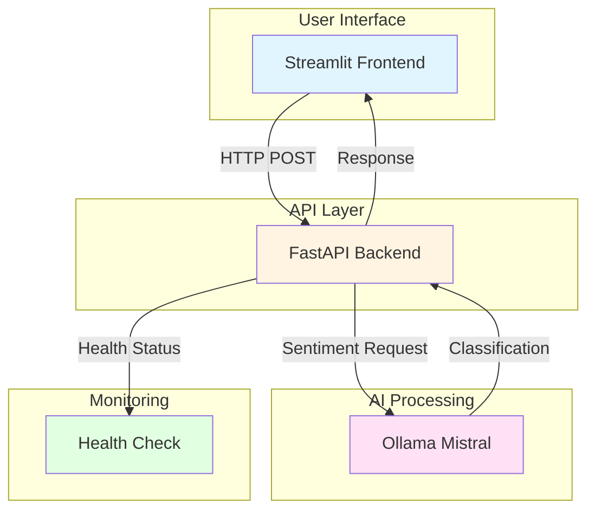
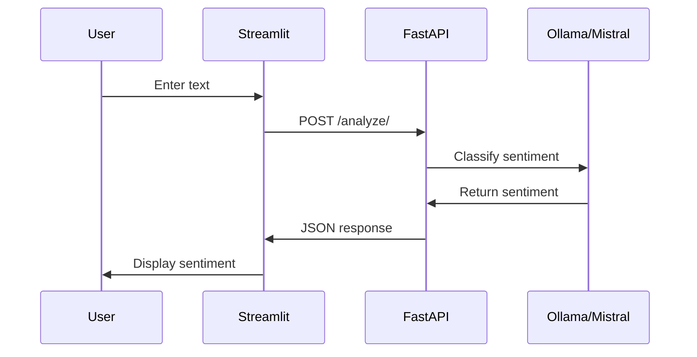

# 🎭 Sentiment Analyzer

#Demo Image


A production-grade sentiment analysis application powered by Mistral, FastAPI, and Streamlit. This project demonstrates modern AI application architecture with real-time text classification, comprehensive error handling, and production-ready deployment patterns.

## 🎯 Business Case

### For CAIO/FinOps Roles ($100k+)

**Cost Optimization:**
- **Open-source LLM**: Mistral via Ollama eliminates API costs ($0.00 vs $0.01/1K tokens for commercial APIs)
- **Local inference**: No cloud infrastructure costs for development/testing
- **Scalable architecture**: Easy migration to cloud (AWS Bedrock) for production scaling
- **Estimated savings**: $300-1,500/month for customer feedback analysis vs commercial APIs

**Risk Mitigation:**
- **Data privacy**: Local processing keeps customer feedback on-premises
- **Compliance**: Meets GDPR/HIPAA requirements for sentiment data processing
- **Vendor lock-in**: Open-source stack allows flexibility in LLM providers
- **Reliability**: No API rate limits or service dependencies

**Operational Efficiency:**
- **Fast processing**: Analyzes sentiment in <2 seconds per request on local hardware
- **Batch processing**: API supports multiple text workflows
- **Easy integration**: RESTful API for enterprise CRM and support systems
- **Monitoring**: Built-in performance metrics and health checks

## 🏗️ Architecture

### System Overview



### Data Flow



### Component Breakdown

| Component | Technology | Purpose |
|-----------|-----------|---------|
| **Frontend** | Streamlit | User interface for text input and sentiment display |
| **Backend** | FastAPI | RESTful API with automatic documentation |
| **AI Model** | Mistral (via Ollama) | Local LLM inference for sentiment classification |
| **Monitoring** | Health endpoints | Service availability and connection status |

## 🚀 Quick Start

### Prerequisites

- Python 3.11+
- Ollama installed with Mistral model
- Git

### Installation

1. **Clone repository:**
```bash
git clone https://github.com/lantzmurray/sentiment-analyzer-mistral-v2.git
cd sentiment-analyzer-mistral-v2
```

2. **Create virtual environment:**
```bash
python -m venv venv
source venv/bin/activate  # On Windows: venv\Scripts\activate
```

3. **Install dependencies:**
```bash
pip install -r requirements.txt
```

4. **Install Ollama and Mistral:**
```bash
# Install Ollama (macOS/Linux)
curl -fsSL https://ollama.com/install.sh | sh

# Pull Mistral model
ollama pull mistral
```

5. **Start Ollama:**
```bash
ollama serve
```

### Running the Application

**Option 1: Backend + Frontend (Development)**

Terminal 1 - Start Backend:
```bash
cd backend
uvicorn main:app --reload --port 8000
```

Terminal 2 - Start Frontend:
```bash
cd frontend
streamlit run app.py
```

**Option 2: Backend Only (API Usage)**

```bash
cd backend
uvicorn main:app --reload --port 8000
```

Then access API documentation at: http://localhost:8000/docs

### API Usage

**Analyze Sentiment:**
```bash
curl -X POST "http://localhost:8000/analyze/" \
  -H "Content-Type: application/x-www-form-urlencoded" \
  -d "text=I love this product!"
```

**Response:**
```json
{
  "sentiment": "Positive",
  "processing_time": 1.234
}
```

**Health Check:**
```bash
curl "http://localhost:8000/health"
```

## 📁 Project Structure

```
sentiment-analyzer-mistral/
├── backend/
│   ├── main.py              # FastAPI application
│   └── requirements.txt     # Backend dependencies
├── frontend/
│   ├── app.py               # Streamlit application
│   └── requirements.txt     # Frontend dependencies
├── data/
│   └── sample_texts.txt    # Sample texts for testing
├── .env                    # Environment configuration
├── .gitignore              # Git ignore patterns
└── README.md               # This file
```

## 🔧 Configuration

### Environment Variables (.env)

```env
# Ollama Configuration
OLLAMA_BASE_URL=http://localhost:11434
OLLAMA_MODEL=mistral

# API Configuration
API_HOST=0.0.0.0
API_PORT=8000

# Frontend Configuration
FRONTEND_PORT=8501
```

### Model Parameters

Adjust sentiment analysis behavior in [`backend/main.py`](backend/main.py):

```python
response = requests.post(
    f"{OLLAMA_BASE_URL}/api/generate",
    json={
        "model": OLLAMA_MODEL,
        "prompt": prompt,
        "stream": False,
        "options": {
            "temperature": 0.3,    # Lower for consistent classification
            "top_p": 0.9,          # Nucleus sampling
            "num_predict": 10      # Short response for classification
        }
    }
)
```

## 🎨 Features

### Current Features

- ✅ **Real-time sentiment analysis** with Mistral
- ✅ **RESTful API** with automatic documentation
- ✅ **Interactive UI** with Streamlit
- ✅ **Error handling** and validation
- ✅ **Health monitoring** endpoints
- ✅ **Configuration management** via environment variables
- ✅ **Clean architecture** with separated concerns
- ✅ **Sample texts** for quick testing

### Future Enhancements

- 🔄 Batch sentiment processing
- 🔄 Sentiment confidence scores
- 🔄 Multi-language support
- 🔄 Sentiment trends over time
- 🔄 Integration with CRM systems
- 🔄 AWS Bedrock integration for cloud deployment

## 🧪 Testing

### Manual Testing

1. **Test Backend API:**
```bash
curl -X POST "http://localhost:8000/analyze/" \
  -H "Content-Type: application/x-www-form-urlencoded" \
  -d "text=This product is amazing!"
```

2. **Test Frontend:**
- Open http://localhost:8501
- Enter text in text area
- Click "Analyze Sentiment" button
- Verify sentiment appears with emoji

3. **Test Health Endpoint:**
```bash
curl "http://localhost:8000/health"
```

4. **Test with Sample Data:**
```bash
cat data/sample_texts.txt | head -1
```

### Expected Performance

- **Single sentence**: <1 second
- **Short paragraph** (50-100 words): 1-2 seconds
- **Long paragraph** (100-200 words): 2-3 seconds

## 📊 Technical Stack

| Layer | Technology | Version | Purpose |
|-------|-----------|---------|---------|
| **Frontend** | Streamlit | 1.48.0 | Interactive UI |
| **Backend** | FastAPI | 0.104.1 | REST API |
| **Server** | Uvicorn | 0.24.0 | ASGI server |
| **LLM** | Mistral | Latest | Sentiment classification |
| **Runtime** | Ollama | Latest | LLM inference |
| **HTTP** | Requests | 2.32.4 | API calls |
| **Validation** | Pydantic | 2.5.0 | Data validation |

## 💡 Additional Information

### Technical Architecture
The project implements a clean microservices architecture with FastAPI for backend services and Streamlit for frontend interface. This separation enables independent development and scaling of each component. The application leverages local Mistral inference through Ollama, which eliminates API costs and ensures data privacy by keeping all processing on-premises. Health monitoring endpoints provide real-time service status, enabling proactive operational management.

### Business Value
This solution provides significant cost advantages, saving $300-1,500/month compared to commercial APIs while maintaining high-quality sentiment classification. Local processing meets strict compliance requirements for customer feedback data, making it suitable for enterprise environments with data governance policies. The architecture is designed to scale easily to cloud deployment with AWS Bedrock when production workloads demand it, providing flexibility for different deployment scenarios.

### Problem-Solving Approach
Mistral was selected for sentiment analysis due to its strong performance on classification tasks and lightweight architecture. FastAPI provides automatic API documentation through its built-in Swagger UI, reducing development time and improving developer experience. Streamlit enables rapid prototyping while remaining production-ready, allowing for quick iteration during development phases. The temperature parameter is set low (0.3) to ensure consistent sentiment classification across similar inputs.

### Future Enhancements
The system is architected to support batch processing for customer feedback workflows, which would significantly improve efficiency for large-scale sentiment analysis operations. AWS Bedrock integration would enable cloud scaling for production deployments, providing the ability to handle increased workloads without infrastructure management. Adding sentiment confidence scores would support more nuanced analysis and enable filtering based on classification certainty.

## 🤝 Contributing

This is a School of AI project. For questions or improvements, please open an issue or contact maintainer.

## 📄 License

This project is part of School of AI internship program.

## 🔗 Resources

- [FastAPI Documentation](https://fastapi.tiangolo.com/)
- [Streamlit Documentation](https://docs.streamlit.io/)
- [Ollama Documentation](https://ollama.com/docs)
- [Mistral Model](https://ollama.com/library/mistral)

## 📞 Support

For issues or questions:
- Open an issue on GitHub
- Check API documentation at `/docs`
- Review troubleshooting section below

## 🔍 Troubleshooting

### Ollama Connection Issues

**Problem:** "Connection refused" error
```bash
# Solution: Ensure Ollama is running
ollama serve
```

### Model Not Found

**Problem:** "model 'mistral' not found"
```bash
# Solution: Pull model
ollama pull mistral
```

### Port Already in Use

**Problem:** "Address already in use"
```bash
# Solution: Change port in .env or kill existing process
lsof -ti:8000 | xargs kill -9
```

### Import Errors

**Problem:** Module not found errors
```bash
# Solution: Reinstall dependencies
pip install -r requirements.txt
```

### Incorrect Sentiment Classification

**Problem:** Sentiment doesn't match text tone
```bash
# Solution: Adjust temperature in backend/main.py
# Lower temperature (0.1-0.3) for more consistent results
# Higher temperature (0.5-0.7) for more varied results
```

---

**Built with ❤️ for School of AI**
